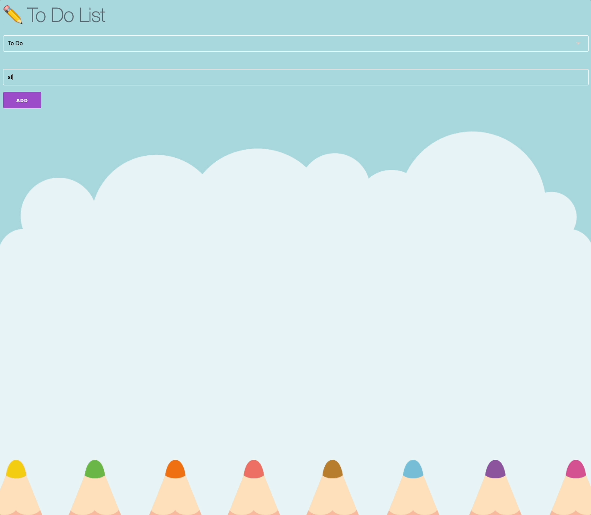

  <a href="https://githubgw.github.io/react-todo">
    
      
    <a display="block" href="https://githubgw.github.io/react-todo">https://githubgw.github.io/react-todo</a>
      
    
  </a>

## Table of contents

- 🔥 [Built with](#built-with)
- 🌈 [Project](#project)
- 📑 [Pages](#pages)
- ⚙ [Features](#features)
- 📝 [License](#license)

## Built with

### Front-end

- `React`
- `Typescript`
- `Recoil`
- `React Hook Form`

### Deploy

- `GitHub`

## Project

> 할 일 추가 및 삭제, 할 일 카테고리 변경

- React Hook Form을 이용해 form의 유효성을 검사하고, 할 일을 추가 및 삭제할 수 있습니다.
- Recoil을 이용해 할 일 목록과 카테고리의 상태를 변경하고, 관리합니다.
    
  

## Pages

> Root

- 홈

## Features

### 📝 To Do

- [x] 할 일 추가
- [x] 할 일 삭제
- [x] 할 일 카테고리 변경

## License

MIT
